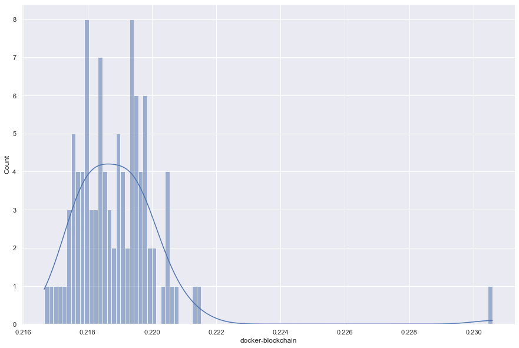
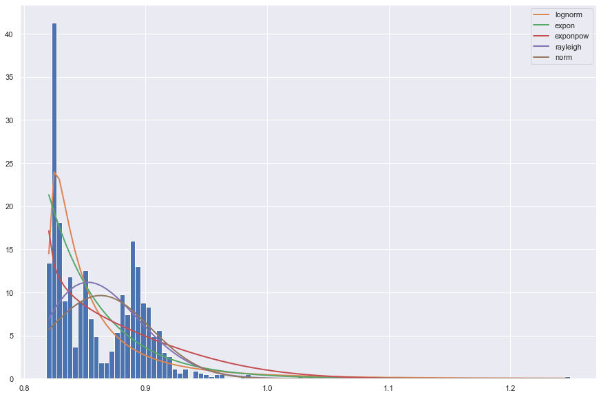
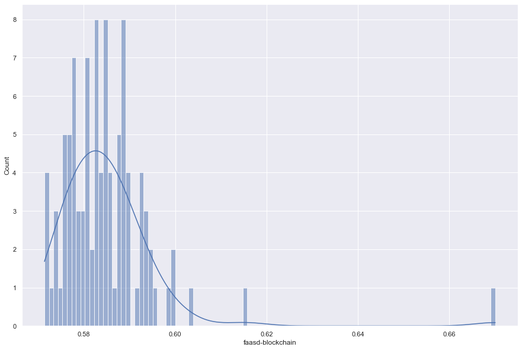
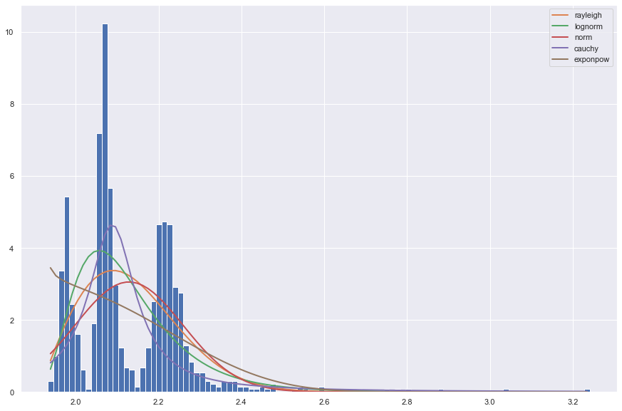
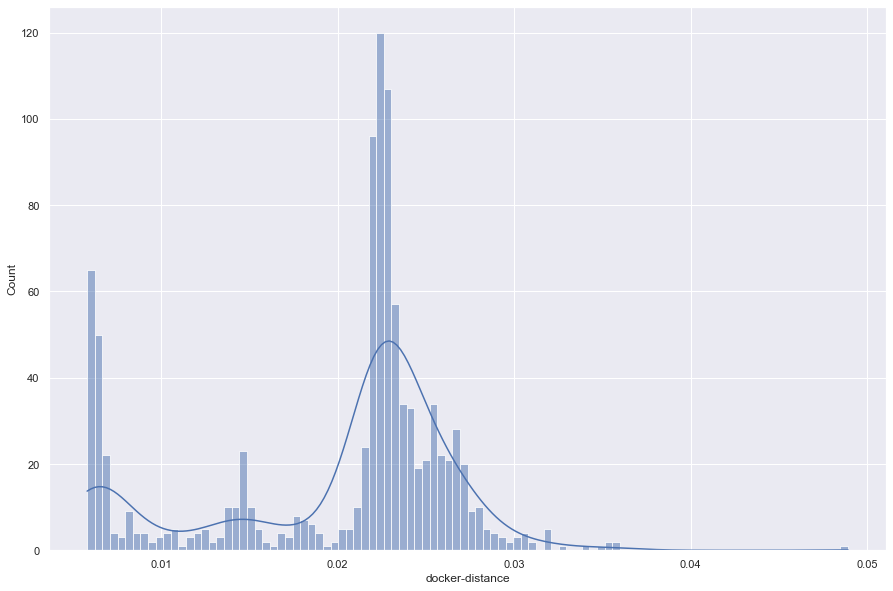
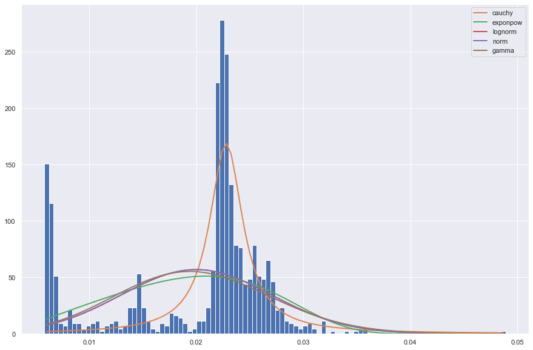
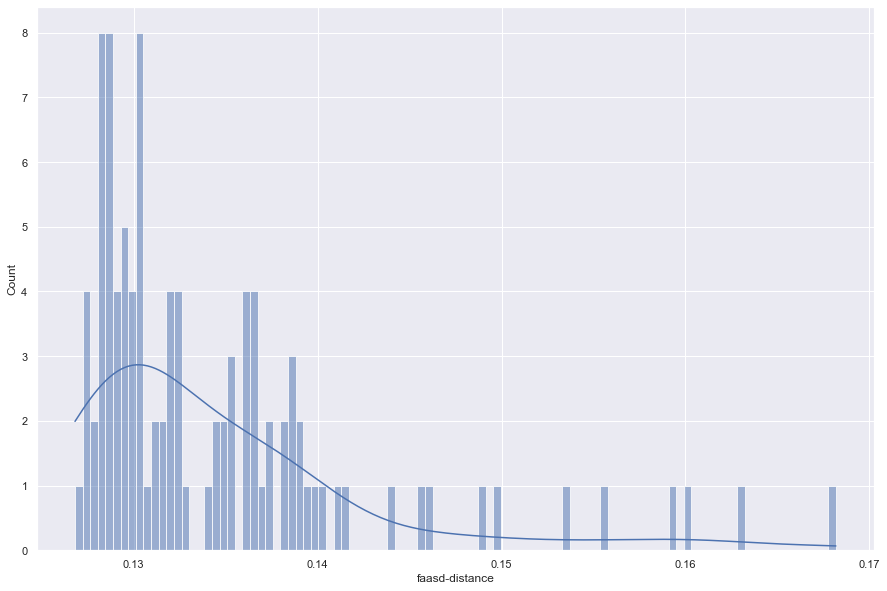
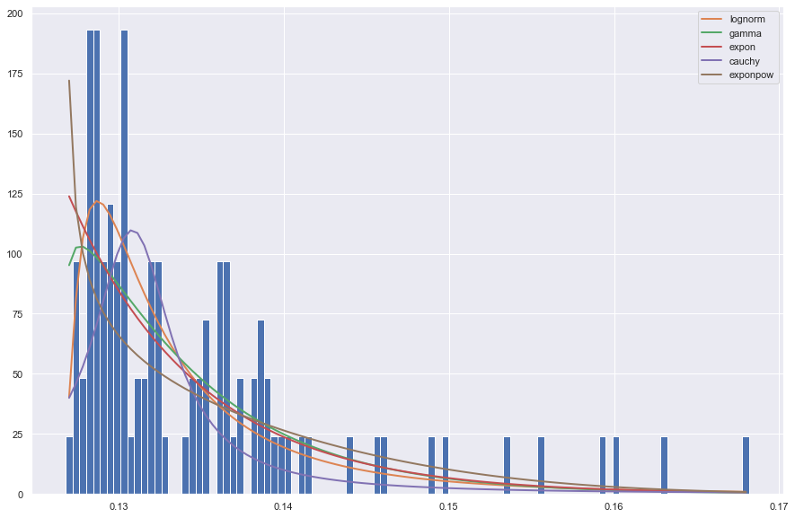

# Fitting Docker vs Faasd  Distribution


```python
import numpy as np
import pandas as pd
import seaborn as sns
import matplotlib.pyplot as plt
from fitter import Fitter, get_common_distributions, get_distributions

pd.options.display.max_rows = 50
sns.set_theme(style="darkgrid")
```


```python
dataset = pd.read_csv("../results/resp_time_distribution.csv")
```


```python
dataset.head()
```


<div>
<style scoped>
    .dataframe tbody tr th:only-of-type {
        vertical-align: middle;
    }

    .dataframe tbody tr th {
        vertical-align: top;
    }

    .dataframe thead th {
        text-align: right;
    }
</style>
<table border="1" class="dataframe">
  <thead>
    <tr style="text-align: right;">
      <th></th>
      <th>docker-distance</th>
      <th>faasd-distance</th>
      <th>docker-blockchain</th>
      <th>faasd-blockchain</th>
    </tr>
  </thead>
  <tbody>
    <tr>
      <th>0</th>
      <td>0.006729</td>
      <td>0.131890</td>
      <td>0.221331</td>
      <td>0.575631</td>
    </tr>
    <tr>
      <th>1</th>
      <td>0.006311</td>
      <td>0.132227</td>
      <td>0.220521</td>
      <td>0.599300</td>
    </tr>
    <tr>
      <th>2</th>
      <td>0.006329</td>
      <td>0.129817</td>
      <td>0.217973</td>
      <td>0.582702</td>
    </tr>
    <tr>
      <th>3</th>
      <td>0.014750</td>
      <td>0.129965</td>
      <td>0.218725</td>
      <td>0.585193</td>
    </tr>
    <tr>
      <th>4</th>
      <td>0.006341</td>
      <td>0.132226</td>
      <td>0.219362</td>
      <td>0.593481</td>
    </tr>
  </tbody>
</table>
</div>


## Blockchain Response Time

### Docker


```python
fig = plt.figure(figsize=(15, 10))

sns.histplot(data=dataset, x="docker-blockchain", bins=100, kde=True)
```


    <AxesSubplot:xlabel='docker-blockchain', ylabel='Count'>


    

    


```python
docker = dataset["docker-blockchain"].values
```


```python
# f = Fitter(docker, timeout=100)
fig = plt.figure(figsize=(15, 10))

f = Fitter(docker, distributions=get_common_distributions())
f.fit()
f.summary(method='sumsquare_error')
```


<div>
<style scoped>
    .dataframe tbody tr th:only-of-type {
        vertical-align: middle;
    }

    .dataframe tbody tr th {
        vertical-align: top;
    }

    .dataframe thead th {
        text-align: right;
    }
</style>
<table border="1" class="dataframe">
  <thead>
    <tr style="text-align: right;">
      <th></th>
      <th>sumsquare_error</th>
      <th>aic</th>
      <th>bic</th>
      <th>kl_div</th>
    </tr>
  </thead>
  <tbody>
    <tr>
      <th>lognorm</th>
      <td>5.159217e+05</td>
      <td>-278.857643</td>
      <td>868.669530</td>
      <td>inf</td>
    </tr>
    <tr>
      <th>rayleigh</th>
      <td>5.309145e+05</td>
      <td>165.627176</td>
      <td>866.928958</td>
      <td>inf</td>
    </tr>
    <tr>
      <th>norm</th>
      <td>6.168766e+05</td>
      <td>486.751439</td>
      <td>881.935746</td>
      <td>inf</td>
    </tr>
    <tr>
      <th>cauchy</th>
      <td>7.760303e+05</td>
      <td>-539.687110</td>
      <td>904.888002</td>
      <td>inf</td>
    </tr>
    <tr>
      <th>expon</th>
      <td>1.271699e+06</td>
      <td>-599.313602</td>
      <td>954.279796</td>
      <td>inf</td>
    </tr>
  </tbody>
</table>
</div>


    

    


```python
f.get_best()
```


    {'lognorm': {'s': 0.38362554251848335,
      'loc': 0.2156574071152112,
      'scale': 0.003015810835749538}}


### Faasd


```python
fig = plt.figure(figsize=(15, 10))

sns.histplot(data=dataset, x="faasd-blockchain", bins=100, kde=True)
```


    <AxesSubplot:xlabel='faasd-blockchain', ylabel='Count'>


    

    


```python
faasd = dataset["faasd-blockchain"].values
```


```python
fig = plt.figure(figsize=(15, 10))

f = Fitter(faasd, distributions=get_common_distributions())
f.fit()
f.summary()
```


<div>
<style scoped>
    .dataframe tbody tr th:only-of-type {
        vertical-align: middle;
    }

    .dataframe tbody tr th {
        vertical-align: top;
    }

    .dataframe thead th {
        text-align: right;
    }
</style>
<table border="1" class="dataframe">
  <thead>
    <tr style="text-align: right;">
      <th></th>
      <th>sumsquare_error</th>
      <th>aic</th>
      <th>bic</th>
      <th>kl_div</th>
    </tr>
  </thead>
  <tbody>
    <tr>
      <th>lognorm</th>
      <td>13018.098962</td>
      <td>75.501438</td>
      <td>500.708082</td>
      <td>inf</td>
    </tr>
    <tr>
      <th>rayleigh</th>
      <td>13658.643283</td>
      <td>680.860140</td>
      <td>500.906103</td>
      <td>inf</td>
    </tr>
    <tr>
      <th>cauchy</th>
      <td>15367.560043</td>
      <td>-105.706414</td>
      <td>512.694729</td>
      <td>inf</td>
    </tr>
    <tr>
      <th>norm</th>
      <td>16438.005276</td>
      <td>909.006732</td>
      <td>519.428455</td>
      <td>inf</td>
    </tr>
    <tr>
      <th>exponpow</th>
      <td>20297.933337</td>
      <td>-73.032873</td>
      <td>545.125927</td>
      <td>inf</td>
    </tr>
  </tbody>
</table>
</div>


    

    


```python
f.get_best()
```


    {'lognorm': {'s': 0.47657052246326603,
      'loc': 0.5662122666859797,
      'scale': 0.01657561789758634}}


## String Distance Response Time

### Docker


```python
fig = plt.figure(figsize=(15, 10))

sns.histplot(data=dataset, x="docker-distance", bins=100, kde=True)
```


    <AxesSubplot:xlabel='docker-distance', ylabel='Count'>


    

    


```python
docker = dataset["docker-distance"].values
```


```python
fig = plt.figure(figsize=(15, 10))

# f = Fitter(docker, timeout=100)
f = Fitter(docker, distributions=get_common_distributions())
f.fit()
f.summary()
```


<div>
<style scoped>
    .dataframe tbody tr th:only-of-type {
        vertical-align: middle;
    }

    .dataframe tbody tr th {
        vertical-align: top;
    }

    .dataframe thead th {
        text-align: right;
    }
</style>
<table border="1" class="dataframe">
  <thead>
    <tr style="text-align: right;">
      <th></th>
      <th>sumsquare_error</th>
      <th>aic</th>
      <th>bic</th>
      <th>kl_div</th>
    </tr>
  </thead>
  <tbody>
    <tr>
      <th>cauchy</th>
      <td>3.511135e+05</td>
      <td>-157.117831</td>
      <td>825.579800</td>
      <td>inf</td>
    </tr>
    <tr>
      <th>lognorm</th>
      <td>1.795848e+06</td>
      <td>-536.844052</td>
      <td>993.397309</td>
      <td>inf</td>
    </tr>
    <tr>
      <th>gamma</th>
      <td>2.347756e+06</td>
      <td>-522.073364</td>
      <td>1020.195552</td>
      <td>inf</td>
    </tr>
    <tr>
      <th>expon</th>
      <td>2.428433e+06</td>
      <td>-562.779833</td>
      <td>1018.968988</td>
      <td>inf</td>
    </tr>
    <tr>
      <th>chi2</th>
      <td>2.570771e+06</td>
      <td>-610.016643</td>
      <td>1029.270115</td>
      <td>inf</td>
    </tr>
  </tbody>
</table>
</div>


    

    


```python
f.get_best()
```


    {'cauchy': {'loc': 0.006222430678432805, 'scale': 0.00024219772921037848}}


### Faasd


```python
fig = plt.figure(figsize=(15, 10))

sns.histplot(data=dataset, x="faasd-distance", bins=100, kde=True)
```


    <AxesSubplot:xlabel='faasd-distance', ylabel='Count'>


    

    


```python
faasd = dataset["faasd-distance"].values
```


```python
fig = plt.figure(figsize=(15, 10))

f = Fitter(faasd, distributions=get_common_distributions())
f.fit()
f.summary()
```


<div>
<style scoped>
    .dataframe tbody tr th:only-of-type {
        vertical-align: middle;
    }

    .dataframe tbody tr th {
        vertical-align: top;
    }

    .dataframe thead th {
        text-align: right;
    }
</style>
<table border="1" class="dataframe">
  <thead>
    <tr style="text-align: right;">
      <th></th>
      <th>sumsquare_error</th>
      <th>aic</th>
      <th>bic</th>
      <th>kl_div</th>
    </tr>
  </thead>
  <tbody>
    <tr>
      <th>lognorm</th>
      <td>63454.105729</td>
      <td>-424.346408</td>
      <td>659.105710</td>
      <td>inf</td>
    </tr>
    <tr>
      <th>gamma</th>
      <td>74215.491087</td>
      <td>-426.460883</td>
      <td>674.771310</td>
      <td>inf</td>
    </tr>
    <tr>
      <th>expon</th>
      <td>79024.819687</td>
      <td>-438.934774</td>
      <td>676.445047</td>
      <td>inf</td>
    </tr>
    <tr>
      <th>cauchy</th>
      <td>96212.125703</td>
      <td>-322.571321</td>
      <td>696.124389</td>
      <td>inf</td>
    </tr>
    <tr>
      <th>exponpow</th>
      <td>102681.517996</td>
      <td>-481.385029</td>
      <td>707.237234</td>
      <td>inf</td>
    </tr>
  </tbody>
</table>
</div>


    

    


```python
f.get_best()
```


    {'lognorm': {'s': 0.9326362516806754,
      'loc': 0.12644619915783525,
      'scale': 0.005418558274471882}}


